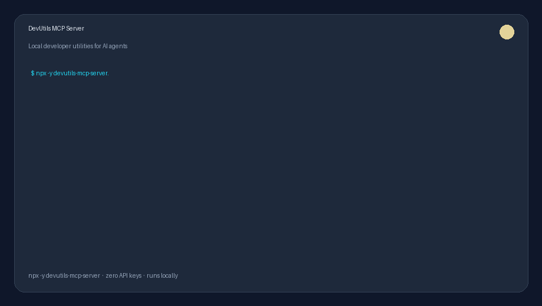

# ­ƒøá´©Å DevUtils MCP Server


> **36 everyday developer tools for any MCP-compatible AI assistant.**
> Hashing, encoding, UUID generation, JWT decoding, JSON formatting, network tools, text utilities, and more ÔÇö all local, no external APIs.

[](https://opensource.org/licenses/MIT)
[](https://modelcontextprotocol.io)
[](https://hub.docker.com)
[](https://www.npmjs.com/package/devutils-mcp-server)
[](https://glama.ai/mcp/servers/paladini/devutils-mcp-server)
[](https://smithery.ai/server/devutils-mcp-server)
[](https://registry.modelcontextprotocol.io)
[](https://github.com/paladini/devutils-mcp-server/stargazers)

**Also available as a plugin:** [devutils-cursor-plugin](https://github.com/paladini/devutils-cursor-plugin) ÔÇö one-click install for Cursor and Claude Code.

<p align="center">
  
</p>

---

## ­ƒÄ» Why?

Every developer needs to hash strings, encode/decode data, generate UUIDs, decode JWTs, format JSON, calculate CIDR ranges, and convert timestamps **every day**. DevUtils MCP Server brings all of these tools directly into your AI assistant ÔÇö works with Claude, Cursor, VS Code, Windsurf, and any other MCP-compatible client.

Think of it as **`busybox` for developer tools** ÔÇö small, essential, and always useful.

---

## ­ƒôª Quick Start

### Option 1 ÔÇö npx (no install)

```bash
npx devutils-mcp-server
```

### Option 2 ÔÇö Docker

```bash
# Pull and run
docker run -i --rm ghcr.io/paladini/devutils-mcp-server

# Or build locally
docker build -t devutils-mcp-server .
docker run -i --rm devutils-mcp-server
```

### Option 3 ÔÇö Local install

```bash
npm install -g devutils-mcp-server
devutils-mcp-server
```

### Option 4 ÔÇö Official MCP Registry

Listed on the [Official MCP Registry](https://registry.modelcontextprotocol.io) as `io.github.paladini/devutils-mcp-server`.

```bash
npx -y devutils-mcp-server
```

Search: https://registry.modelcontextprotocol.io ÔÇö query `io.github.paladini/devutils`

---

## ÔÜÖ´©Å Client Setup

### Claude Desktop

Add to `~/Library/Application Support/Claude/claude_desktop_config.json` (macOS) or `%APPDATA%\Claude\claude_desktop_config.json` (Windows):

```json
{
  "mcpServers": {
    "devutils": {
      "command": "npx",
      "args": ["-y", "devutils-mcp-server"]
    }
  }
}
```

Or with Docker:

```json
{
  "mcpServers": {
    "devutils": {
      "command": "docker",
      "args": ["run", "-i", "--rm", "ghcr.io/paladini/devutils-mcp-server"]
    }
  }
}
```

### Cursor

**Plugin (recommended):** Install [DevUtils MCP](https://github.com/paladini/devutils-cursor-plugin) from **Cursor Settings  Customize**, or add from GitHub `paladini/devutils-cursor-plugin`.

**Manual:** Add to your Cursor MCP settings (`~/.cursor/mcp.json`):

```json
{
  "mcpServers": {
    "devutils": {
      "command": "npx",
      "args": ["-y", "devutils-mcp-server"]
    }
  }
}
```

### Claude Code

Install the plugin:

```text
/plugin marketplace add paladini/devutils-cursor-plugin
/plugin install devutils-mcp@devutils-cursor-plugin
```

### VS Code (GitHub Copilot)

Add to your `.vscode/mcp.json` in the workspace, or to your user settings:

```json
{
  "servers": {
    "devutils": {
      "type": "stdio",
      "command": "npx",
      "args": ["-y", "devutils-mcp-server"]
    }
  }
}
```

### Windsurf

Add to `~/.codeium/windsurf/mcp_config.json`:

```json
{
  "mcpServers": {
    "devutils": {
      "command": "npx",
      "args": ["-y", "devutils-mcp-server"]
    }
  }
}
```

### Docker MCP Toolkit (Docker Desktop)

If this server is available in the [Docker MCP Catalog](https://hub.docker.com/mcp), you can enable it directly from Docker Desktop:

1. Open **Docker Desktop**  **MCP Toolkit**
2. Search for **DevUtils**
3. Click **Enable**

### Local Development

```bash
npm install
npm run dev
```

---

## ­ƒöº Available Tools (36 total)

### ­ƒöÉ Hash Tools (6)
| Tool | Description |
|------|-------------|
| `hash_md5` | Generate MD5 hash |
| `hash_sha1` | Generate SHA-1 hash |
| `hash_sha256` | Generate SHA-256 hash |
| `hash_sha512` | Generate SHA-512 hash |
| `hash_bcrypt` | Generate bcrypt hash (configurable rounds) |
| `hash_bcrypt_verify` | Verify string against bcrypt hash |

### ­ƒöä Encoding Tools (8)
| Tool | Description |
|------|-------------|
| `base64_encode` | Encode string to Base64 |
| `base64_decode` | Decode Base64 to string |
| `url_encode` | URL-encode (percent-encoding) |
| `url_decode` | Decode URL-encoded string |
| `html_encode` | Encode HTML entities |
| `html_decode` | Decode HTML entities |
| `hex_encode` | Encode string to hex |
| `hex_decode` | Decode hex to string |

### ­ƒÄ▓ Generator Tools (4)
| Tool | Description |
|------|-------------|
| `generate_uuid` | Cryptographic UUID v4 (batch support) |
| `generate_nanoid` | Compact URL-friendly ID (configurable length) |
| `generate_password` | Secure password (configurable complexity) |
| `generate_random_hex` | Random hex string (configurable length) |

### ­ƒöæ JWT Tools (2)
| Tool | Description |
|------|-------------|
| `jwt_decode` | Decode JWT header & payload (with human-readable dates) |
| `jwt_validate` | Validate JWT structure & expiration |

### ­ƒôØ Formatter Tools (3)
| Tool | Description |
|------|-------------|
| `json_format` | Pretty-print or minify JSON |
| `json_validate` | Validate JSON with error location |
| `json_path_query` | Extract values using dot-notation path |

### ­ƒöó Converter Tools (5)
| Tool | Description |
|------|-------------|
| `timestamp_to_date` | Unix timestamp  human date (timezone support) |
| `date_to_timestamp` | Date string  Unix timestamp |
| `number_base_convert` | Convert between bases (bin/oct/dec/hex/any) |
| `color_convert` | Convert colors (HEX Ôåö RGB Ôåö HSL) |
| `byte_convert` | Convert byte units (B/KB/MB/GB/TB/PB) |

### ­ƒîÉ Network Tools (2)
| Tool | Description |
|------|-------------|
| `cidr_calculate` | CIDR  network, broadcast, mask, host range, host count |
| `ip_validate` | Validate & classify IPv4/IPv6 address |

### ԣŴ©Å Text Tools (6)
| Tool | Description |
|------|-------------|
| `text_stats` | Character/word/line/sentence count, reading time |
| `lorem_ipsum` | Generate placeholder text |
| `case_convert` | Convert between camelCase, snake_case, PascalCase, etc. |
| `slugify` | Convert string to URL-friendly slug |
| `regex_test` | Test regex pattern against input |
| `text_diff` | Line-by-line diff between two texts |

---

## ­ƒÅù´©Å Architecture

```
src/
Ôö£ÔöÇÔöÇ index.ts          # MCP server entry point (stdio transport)
ÔööÔöÇÔöÇ tools/
    Ôö£ÔöÇÔöÇ hash.ts       # Cryptographic hash functions
    Ôö£ÔöÇÔöÇ encoding.ts   # Encode/decode utilities
    Ôö£ÔöÇÔöÇ generators.ts # ID and password generators
    Ôö£ÔöÇÔöÇ jwt.ts        # JWT decode and validation
    Ôö£ÔöÇÔöÇ formatters.ts # JSON formatting and querying
    Ôö£ÔöÇÔöÇ converters.ts # Data type and unit converters
    Ôö£ÔöÇÔöÇ network.ts    # Network calculation utilities
    ÔööÔöÇÔöÇ text.ts       # Text analysis and manipulation
```

**Tech Stack:**
- TypeScript + Node.js 22
- `@modelcontextprotocol/sdk` ÔÇö Official MCP SDK
- `bcryptjs` ÔÇö Password hashing
- `nanoid` ÔÇö Compact ID generation
- `zod` ÔÇö Input validation

**Zero external API dependencies.** All tools run locally with no network calls.

---

## ­ƒÉ│ Docker

The image uses a multi-stage build for minimal size:

1. **Build stage**: Compiles TypeScript on Node 22 Alpine
2. **Runtime stage**: Runs compiled JS on Node 22 Alpine as non-root user

```bash
# Build
docker build -t devutils-mcp-server .

# Test (send an MCP initialize request)
echo '{"jsonrpc":"2.0","id":1,"method":"initialize","params":{"protocolVersion":"2024-11-05","capabilities":{},"clientInfo":{"name":"test","version":"1.0.0"}}}' | docker run -i --rm devutils-mcp-server
```

---

## ÔØô FAQ & Design Philosophy

### Why MCP, and not just a library?

**Valid criticism:** If you're writing Python scripts and need to hash something, `hashlib` is 2 lines of code. Why run MCP overhead?

**Answer:** This server is optimized for **AI agents** in multi-step workflows, not programmers writing code:

1. **AI hallucination cost >> MCP overhead**  
   An AI model spending 50ms calling an MCP tool (vs. 1ms library call) is negligible when the alternative is the model *making up a hash* or using the wrong encoding. A wrong hash  debugging time  1000x worse than overhead.

2. **Reliable tool semantics**  
   Libraries let the model do *anything* (import, call, write loops). MCP enforces strict tool contracts. For example, `jwt_decode` *always* returns human-readable dates with timezone support ÔÇö no model confusion about Unix epoch interpretation.

3. **Universally accessible**  
   Any MCP-compatible client (Claude, Cursor, VS Code Copilot, Windsurf, and more) can use these tools. A Python library only works if your agent is Python-based.

4. **Multi-tenant safety**  
   In production systems, letting AI agents run arbitrary library code is a security risk. MCP provides explicit tool whitelisting with input validation.

### When to use DevUtils versus alternatives

**Use DevUtils if:**
- You're using Claude, Cursor, VS Code Copilot, Windsurf, or any MCP-compatible AI assistant
- You want reliable, validated utility operations in your AI workflows
- You need 36+ tools in one package (vs. learning 8 different tool specs)
- You want educational reference implementations of common algorithms

**Don't use DevUtils if:**
- You're writing regular Python/Node/Go code (use native libraries like `hashlib`, `crypto`)
- You need extreme performance (direct library calls are 1000x faster)
- Your AI client does not support MCP

### Design philosophy

- **Small & focused**: 36 utilities, zero external APIs, ~50MB container
- **Security-first**: Non-root user, Alpine Linux, minimal attack surface
- **AI-friendly**: Consistent naming (`<domain>_<operation>`), strict schemas, human-readable outputs
- **Client-agnostic**: Works with any MCP-compatible client via stdio transport
- **Battle-tested**: Each tool references standard implementations (zod validation, bcryptjs hashing, etc.)

---

## ­ƒîì Available on

| Channel | Link |
| --- | --- |
| **Official MCP Registry** | `io.github.paladini/devutils-mcp-server` ÔÇö [registry.modelcontextprotocol.io](https://registry.modelcontextprotocol.io) |
| **npm** | [devutils-mcp-server](https://www.npmjs.com/package/devutils-mcp-server) |
| **Glama** | [glama.ai/mcp/servers/paladini/devutils-mcp-server](https://glama.ai/mcp/servers/paladini/devutils-mcp-server) |
| **Smithery** | [smithery.ai/server/devutils-mcp-server](https://smithery.ai/server/devutils-mcp-server) |
| **Cursor / Claude plugin** | [devutils-cursor-plugin](https://github.com/paladini/devutils-cursor-plugin) |

---

## ­ƒôØ Contributing

Questions and ideas: [GitHub Discussions](https://github.com/paladini/devutils-mcp-server/discussions)

1. Fork the repository
2. Create your feature branch (`git checkout -b feat/amazing-tool`)
3. Commit your changes (`git commit -m 'feat: add amazing tool'`)
4. Push to the branch (`git push origin feat/amazing-tool`)
5. Open a Pull Request

---

## ­ƒôä License

MIT ┬® [Fernando Paladini](https://github.com/paladini)
